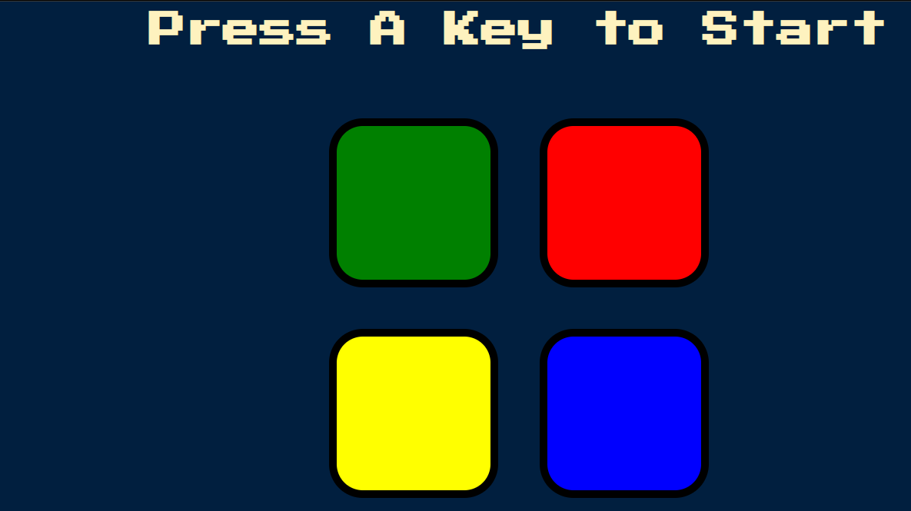

# Simon-Game
Simon Game using HTML CSS, JAVASCRIPT AND JQUERY

### Screenshot

### Links

- Solution URL: [Add solution URL here](https://your-solution-url.com)
- Live Site URL: [Add live site URL here](https://your-live-site-url.com)

## My process

### Built with

- Semantic HTML5 markup
- CSS custom properties
- Javascript
-jQuery

